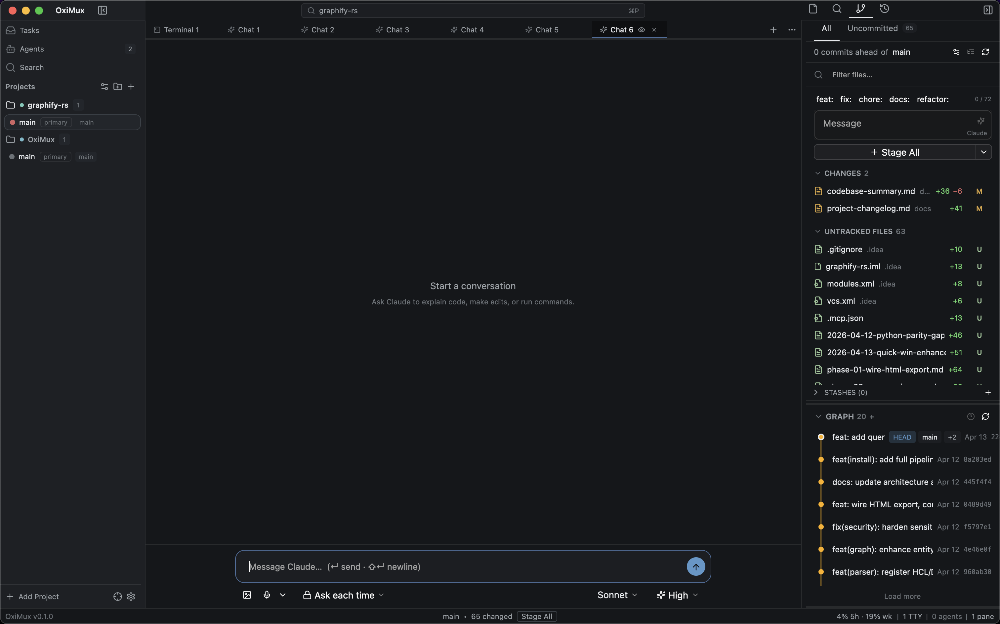
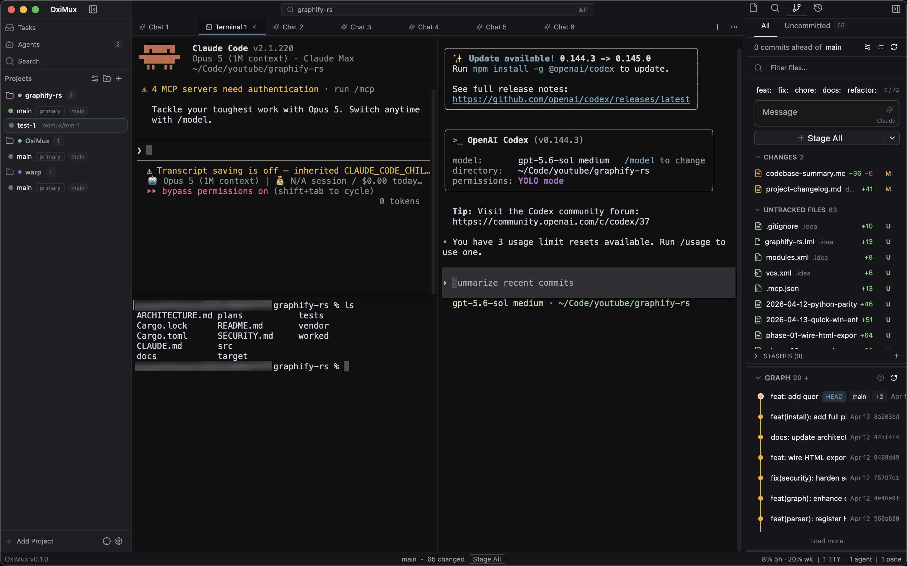

# OxiMux

A Rust-native, multi-agent development cockpit for macOS. Open a repo → spawn isolated worktrees → run CLI coding agents (Claude Code, Codex, Aider) in parallel → review every change through a GitLens-grade Git UX.

- **Stack**: Rust 1.95 (edition 2024) + GPUI + [`longbridge/gpui-component`](https://github.com/longbridge/gpui-component) + SQLite + Tokio
- **Status**: Working cockpit, in active development. Dogfoodable for day-to-day repo work; pre-1.0, so expect rough edges.
- **Platform**: macOS-only in v1 (13.0+).





## Quick start

```bash
# Build the PTY relay daemon first — the app resolves it as a sibling of
# its own binary, and without it terminals fall back to in-process PTYs
# that don't survive a relaunch.
cargo build -p oximux-relay --release

# Build + run the shell (release ~slow first time due to GPUI compile)
cargo run -p oximux-app --release

# Or produce an .app bundle in dist/ (bundles oximux + oximux-relay)
./scripts/bundle-macos.sh
open dist/OxiMux.app
```

### Building on Windows

macOS is still the shipping target; the Windows port lives on `feat/windows`.
What it leaves behind is recorded in
[`docs/windows-port-exclusions.md`](docs/windows-port-exclusions.md).

```powershell
# Produce dist/OxiMux — the app plus every sibling it resolves at runtime
# (relay daemon, screen-control hook, ripgrep, dictation DLLs).
./scripts/bundle-windows.ps1
./dist/OxiMux/oximux.exe
```

Running straight out of `target/` works too, but only the bundle carries
`oximux-screen-gate.exe`, and without it agent chats run unpoliced. See
[`docs/windows-packaging.md`](docs/windows-packaging.md).

Beyond the Rust toolchain and the MSVC build tools, Windows needs **LLVM**, which
macOS gets for free from Xcode:

```powershell
winget install LLVM.LLVM
```

`sherpa-rs-sys` — reached only through `oximux-dictation`, and so only by
`oximux-app` — runs `bindgen`, which needs `libclang`. Nothing else in the
workspace does, which is why every crate except the desktop app builds without
this.

`C:\Program Files\LLVM\bin` must then be on `PATH`, not merely named in
`LIBCLANG_PATH`: with only the latter, libclang loads but cannot locate its own
resource-dir headers, and the build fails on `'stdint.h' file not found`. The
winget package does not add it to `PATH` for you.

Neither requirement shows up in CI — GitHub's Windows runners preinstall LLVM —
so the compile gate passing is not evidence that a clean machine can build.

`--workspace` commands need one macOS-only crate excluded, the same way the
Windows CI job spells it. `oximux-computer-use` used to sit beside it and no
longer does — it compiles and its tests pass on Windows:

```powershell
cargo check --workspace --all-targets --exclude oximux-macos-trust

# Build the relay first here too — the app resolves `oximux-relay.exe` as a
# sibling of its own binary.
cargo build -p oximux-relay -p oximux-app
```

## The `oximux` CLI

`oximux` is the scriptable client of a running host — the desktop app, or
`oximux serve` on a headless machine. It drives sessions, agents, schedules, git,
and worktrees from a shell or a CI job, locally or over a paired remote link.

See [docs/cli-reference.md](docs/cli-reference.md) for every command and flag.
It's generated straight from the parser (`scripts/gen-cli-docs.sh`), so it
can't drift from what the binary actually accepts.

```bash
curl -fsSL https://raw.githubusercontent.com/nhtera/OxiMux/main/scripts/install-cli.sh | sh
```

```powershell
irm https://raw.githubusercontent.com/nhtera/OxiMux/main/scripts/install-cli.ps1 | iex
```

Installs `oximux` and `oximux-relay` into `~/.local/bin` (macOS/Linux) or
`%LOCALAPPDATA%\Programs\oximux` (Windows). Both binaries, always: they speak a
handshake versioned in lockstep, so one without the other cannot talk to itself.

Afterwards it updates itself:

```bash
oximux update --check   # what's available, changes nothing
oximux update           # verify signature, then replace both binaries
```

Updates are verified against a maintainer signature over the release manifest,
checked before any checksum in that manifest is believed, using a key compiled
into the binary. A build with no key refuses to update rather than falling back
to checksum-only trust. The installers are the one weaker step — they run before
there is a verified binary to run — and take `--require-signature`
(`-RequireSignature`) to close that gap when `minisign` is available. See
[docs/release-signing.md](docs/release-signing.md).

Installed through Homebrew instead? `oximux update` will tell you to use
`brew upgrade oximux` — two things owning one set of files is a state neither
can reason about.

## Repo layout

`apps/` holds the shippable product surfaces; `crates/` holds the libraries and
sidecars they consume.

```
apps/
├── cli/          Scriptable client of a running host + `oximux serve`
│                 (headless host), bin `oximux-cli` (package `oximux-cli`),
│                 installed on PATH as `oximux` — see docs/cli-reference.md
├── desktop/      GPUI host shell, bin `oximux` (package `oximux-app`):
│                 panes/tabs/splits, SCM, diff viewer, command palette,
│                 agent chat. Modules are foldered by concern
│                 (app_settings/ agent_glue/ session_restore/ platform/
│                 loaders/ shell/terminal/)
└── mobile/       Expo / React Native client for pairing a phone to a
                  desktop host. modules/oximux-core is the uniffi turbo
                  module generated from crates/mobile-core (untracked —
                  regenerate with `npm run bindings`)
crates/
├── ui/           shared, app-agnostic GPUI widgets (FloatingSurface overlay,
│                 button variants, confirm dialog) — depends only downward
├── core/         domain types (Project, Workspace, Pane, AgentSession)
├── pty/          portable-pty + alacritty_terminal backend
├── git/          git CLI wrappers, status poller, diff parser, clone
├── agent-core/   portable agent-chat core (thread fold, ThreadEvent vocab,
│                 stream-json decoder) — no gpui/pty/tokio, so it
│                 cross-compiles for the mobile Rust core
├── agents/       AgentRuntime trait + provider adapters (Claude, Codex,
│                 ACP, Pi) and session import
├── editor/       gpui-component editor wrapper + LSP glue
├── dictation/    offline voice dictation (sherpa-onnx + CoreAudio capture)
├── storage/      SQLite + migration ladder + CI guard
├── settings/     theme tokens, density, typography, TOML config
├── relay-proto/  wire protocol shared by relay daemon + client
├── relay/        out-of-process PTY relay daemon (survives relaunch)
├── relay-client/ in-app client for the relay daemon
├── remote-proto/ remote-control wire protocol (desktop host ⇄ phone)
├── remote-host/  in-app remote-control host: pairing auth + RPC dispatch
├── remote-session/  client-side remote session (the phone's Rust core)
├── remote-iroh/  iroh P2P (QUIC) transport for remote control
├── mobile-core/  uniffi binding over remote-session for the RN app
├── proc-cwd/     resolve a process's cwd from its pid
└── proc-tree/    walk a process's descendants, to name the agent CLI a
                  terminal is running
xtask/            repo lint orchestrator (file-size cap etc.)
docs/
├── design-guidelines.md   palette, density, typography (the contract)
├── system-architecture.md source map + subsystem contracts
├── gpui-pins.md           GPUI + gpui-component SHA tuple + bump log
├── brief.md               product vision and PRD
└── adr/                   decision records — gitignored, local to each
                           working copy
plans/            implementation plans + reports — gitignored
```

## Capabilities

- **Workspaces & worktrees** — open a repo, spin up isolated `oximux/<slug>` worktrees per task; create, switch, archive, stash.
- **Panes & terminals** — split panes, tabs, a floating terminal; PTYs run out-of-process via the relay daemon and survive an app relaunch.
- **CLI agents** — spawn Claude Code / Codex / Aider in tabs; an agents dashboard tracks per-session status (`Running`, `NeedsApproval`, `Done`, `Failed`).
- **Git / SCM** — status poller, staged/unstaged review, commit (with AI-drafted messages), commit graph, branch picker, push/pull/sync, CI badge, `gh pr create`.
- **Diff viewer** — a custom-canvas renderer with per-line geometry, word-diff, combined-diff, and folded hunks.
- **Navigation** — a command palette (Quick Open + commands, fuzzy match), file explorer, search panel.
- **Design system** — charcoal dark theme, cockpit density, typography scale (`oximux-settings`; see `docs/design-guidelines.md`).
- **Guardrails** — `xtask file-size-lint` (warn > 1500 LOC / fail > 3000, with a ratchet allowlist that only shrinks), font-kit feature check, migration ladder count check, producer/consumer pre-commit hook.
- **Decision records** — ADRs live under `docs/adr/`, which is **gitignored**: they are local to a working copy, not shipped with the repo, so the list below is the index rather than a set of links. 001 (stack), 002 (gpui-component), 003 (dogfood gate), 004 (no ACP in v1 — **superseded**; ACP adapters ship in `crates/agents/src/thread/acp/`), 005 (fresh start), 006 (Tier-1 reorg + `oximux-ui` extraction), 007 (`apps/desktop` relocation).

## Working agreements

- **Keep files small** — aim for **< 500 LOC** per file (authoring guideline, not enforced). The lint enforces **warn > 1500 / fail > 3000** non-blank LOC; any file over 3000 must sit on the `xtask/file-size-allow.txt` ratchet allowlist and may only shrink. Split before you hit the warn band. (Where things live: see `docs/system-architecture.md` → "Source map".)
- **Snake_case** for Rust files; kebab-case for shell scripts.
- **Edit existing files** in-place. No `*_v2.rs`, `*_new.rs`, or `*_enhanced.rs`.
- **Dogfood before tag** (ADR-003).
- **No code reuse** from `OxideADE-old`. Ideas only (ADR-005).

## Install pre-commit hook (optional)

```bash
ln -sf ../../scripts/pre-commit-producer-consumer.sh .git/hooks/pre-commit
```

Warns (does not block) when a staged diff deletes a public symbol so consumers can be audited before merge.

## License

[Apache License 2.0](LICENSE). You may use, modify, and redistribute OxiMux —
including commercially — provided you retain the copyright notice, the
[`NOTICE`](NOTICE) file, and mark any files you change.

"OxiMux" and the OxiMux logo are **not** covered by the license grant
(Apache-2.0 §6): forks are welcome, forks distributed under the OxiMux name are
not.
